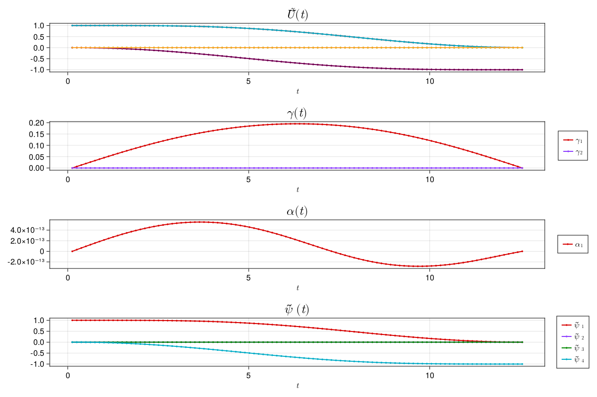
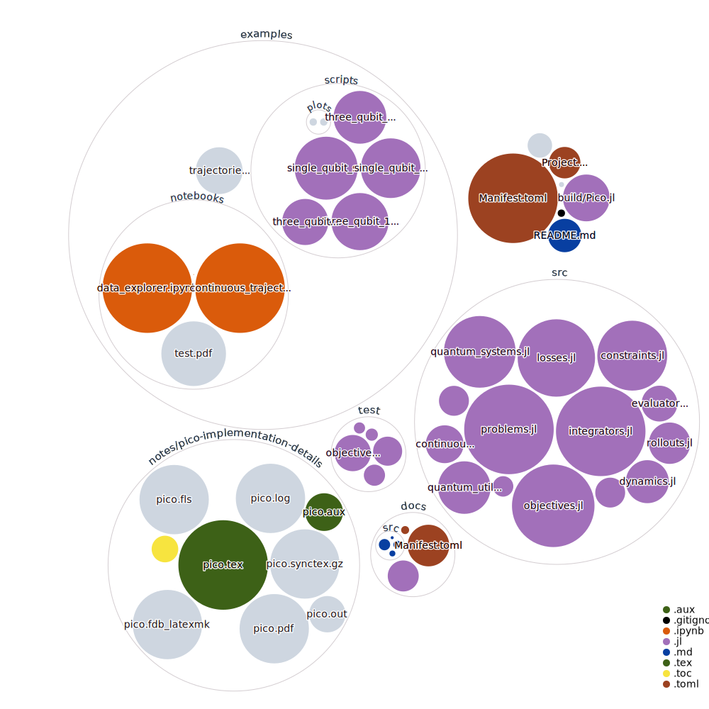

# QuantumCollocation.jl

[](https://aarontrowbridge.github.io/QuantumCollocation.jl/stable/)
[](https://aarontrowbridge.github.io/QuantumCollocation.jl/dev/)
[](https://github.com/aarontrowbridge/QuantumCollocation.jl/actions/workflows/CI.yml?query=branch%3Amain)
[](https://codecov.io/gh/aarontrowbridge/QuantumCollocation.jl)

**QuantumCollocation.jl** uses [NamedTrajectories.jl](https://github.com/aarontrowbridge/NamedTrajectories.jl) to set up and solve direct collocation problems specific to quantum optimal control, i.e. problems of the form:

```math
\begin{aligned}
\underset{U_{1:T}, a_{1:T-1}}{\text{minimize}} & \quad \ell(U_T, U_{\text{goal}})\\
\text{ subject to } & \quad U_{t+1} = \exp(-i H(a_t)) U_t 
\end{aligned}
```

QuantumCollocation.jl gives the user the ability to add other constraints and objective functions to this problem and solve it efficiently using [Ipopt.jl](https://github.com/jump-dev/Ipopt.jl) and [MathOptInterface.jl](https://github.com/jump-dev/MathOptInterface.jl) under the hood.

## Notice!

This package is under active development and issues may arise -- please be patient and report any issues you find!

## Installation

QuantumCollocation.jl is not yet registered, so you will need to install it manually:

```julia
using Pkg
Pkg.add(url="https://github.com/aarontrowbridge/QuantumCollocation.jl", rev="main")
```

## Implementation Details

For a details of the implementation, in the current absence of a documenation page, please see the (rough) notes document [pico.pdf](notes/pico-implementation-details/pico.pdf).

## Examples

### Single Qubit X-Gate
See the example script [examples/scripts/single_qubit_gate.jl](examples/scripts/single_qubit_gate.jl), which  produces the following plot:



## Repo Structure

Uses GitHub Next's [repo-visualization](https://githubnext.com/projects/repo-visualization/) tool to see repo structure.


