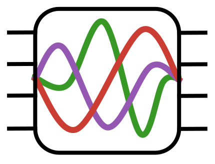

# QuantumCollocation.jl

<div align="center"> <a href="https://github.com/kestrelquantum/Piccolo.jl">
    
</a> </div>


<div align="center">

| **Documentation** | **Build Status** | **Support** | **Paper** | **License** |
|:-----------------:|:----------------:|:-----------:|:---------:|:-----------:|
| [](https://kestrelquantum.github.io/QuantumCollocation.jl/dev/) | [](https://github.com/kestrelquantum/QuantumCollocation.jl/actions/workflows/CI.yml?query=branch%3Amain) [](https://codecov.io/gh/kestrelquantum/QuantumCollocation.jl)| [](https://unitary.fund) | [](https://arxiv.org/abs/2305.03261) | [](https://opensource.org/licenses/MIT)


</div>


**QuantumCollocation.jl** uses [NamedTrajectories.jl](https://github.com/kestrelquantum/NamedTrajectories.jl) to set up and solve direct collocation problems specific to quantum optimal control, i.e. generating a *pulse* sequence $a_{1:T-1}$ to drive a quantum system and realize a target gate $U_{\text{goal}}$. We formulate this problem as a nonlinear program (NLP) of the form

```math
\begin{aligned}
\underset{U, a, \Delta t}{\text{minimize}} & \quad \ell(U_T, U_{\text{goal}})\\
\text{ subject to } & \quad U_{t+1} = \exp(-i \Delta t H(a_t)) U_t 
\end{aligned}
```

Where the dynamics between *knot points* $(U_t, a_t)$ and $(U_{t+1}, a_{t+1})$ are enforced as constraints on the states which are free variables in the solver; this optimization framework is called *direct collocation*.  For details of our implementation please see our award-winning IEEE QCE 2023 paper, [Direct Collocation for Quantum Optimal Control](https://arxiv.org/abs/2305.03261). If you use QuantumCollocation.jl in your work, please cite :raised_hands:!

QuantumCollocation.jl gives the user the ability to add other constraints and objective functions to this problem and solve it efficiently using [Ipopt.jl](https://github.com/jump-dev/Ipopt.jl) and [MathOptInterface.jl](https://github.com/jump-dev/MathOptInterface.jl) under the hood.

## :warning: Notice :warning:

This package is under active development and issues may arise -- please be patient and report any issues you find!

## Installation

QuantumCollocation.jl is registered! To install:

```julia
using Pkg
Pkg.add(QuantumCollocation)
```

## Examples

### Single Qubit X-Gate
See the example script [examples/scripts/single_qubit_gate.jl](examples/scripts/single_qubit_gate.jl), which  produces the following plot:


## Quickstart developers guide

__Install Julia__ [Juliaup](https://github.com/JuliaLang/juliaup) is an installer and version manager. This is one useful way to manage Julia versions and keep up with the latest changes. After installing, run `julia` to obtain the Julia _REPL_.

__Julia environments__
[(Documentation)](https://pkgdocs.julialang.org/v1/environments/#Using-someone-else's-project) Your project's environment is stored in _Project.toml_. You can interactively add packages to an environment by using the Julia command line _REPL_ and _package manager_.  Start Julia in the project folder. Type `]` to enter the package manager. Type `activate .` to activate or create an environment specified by _Project.toml_ located in the current folder. Separately, you generate a manifest (solving the versions to create a valid environment) by running `instantiate`; instantiate will check that the environment is correct after you add all the packages you want.

__Adding packages__
[(Documentation)](https://pkgdocs.julialang.org/v1/managing-packages/#Adding-packages) The initial cell for a Piccolo notebook might look something like the following:
```Julia
# Standard packages
using LinearAlgebra
using CairoMakie

# Piccolo packages
using QuantumCollocation
using NamedTrajectories
using TrajectoryIndexingUtils
```

First, let's install some standard packages (these are like Numpy and Matplotlib). Open the package manager in the current environment (type `julia`, `]`, and `activate .`), type `add LinearAlgebra` to install and precompile _LinearAlgebra_. Same with `CairoMakie`. 

Second, let's install _Piccolo_. There are three packages (_QuantumCollocation_, _NamedTrajetories_, _TrajectoryIndexingUtils_) inside [Piccolo](https://docs.juliahub.com/General/Piccolo/stable/). We could do `add Piccolo` to get the three as a bundle from the Julia repository. Instead of individually calling `using ...` for each, this approach only requires `using Piccolo` at the start of a file or notebook.

As a developer, we want to use the git repositories directly from [the Kestrel Quantum Github page](https://github.com/kestrelquantum). Clone, then add the local packages to the Project file with e.g. `dev ../relative/path/to/repo/QuantumCollocation`. This command installs the development version of _QuantumCollocation_ pointing to the local Github code instead of the package repository. You can repeat this for the others, also.

__Developing__
[Revise.jl](https://timholy.github.io/Revise.jl/stable/) will let you edit source code, update packages, and reload the changes in a notebook---automatically! This is a great tool for development. `add Revise` from the REPL and then include it before any packages you intend to edit:
```Julia
using Revise
using QuantumCollocation
```

### Tips for Visual Studio Code
__Julia extension__ You can run Julia notebooks and much more with [the Julia extension](https://code.visualstudio.com/docs/languages/julia). Upon opening your project folder in VS code and attempting to run an `.ipynb`, you will see that VS Code finds the interpreters managed by juliaup and defaults to using the environment based on the _Project.toml_ in the project directory.

__Fonts__ VS Code will not display all characters allowed by Julia. You can change the editor font family in the settings to `'JuliaMono'` to get full support. If you don't want to mix and mash, you can create a new VS Code settings profile for working in Julia at _File>Preferences>Profile_.

__Tests__ Tests should automatically populate in VS Code when working with a Piccolo package. For example, just by adding the `QuantumCollocation.jl` folder to your workspace, you should see tests appear if you click on the _Testing_ sidebar icon. If you run one of these tests, a new Julia kernel is spawned for the test. You can find the kernel if you click on the _Julia_ sidebar icon (after installing the Julia extensions). Sometimes, for the tests to recognize new changes, you may need to manually kill this kernel to see your changes reflected.

