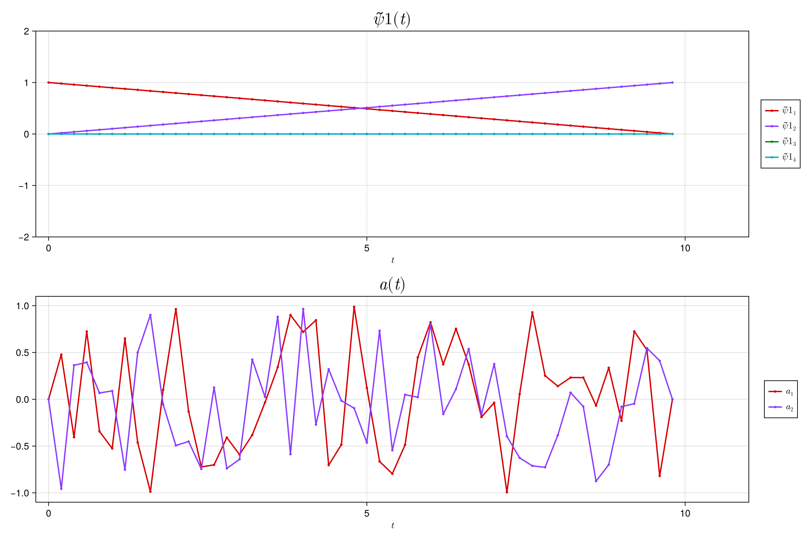

```@meta
EditURL = "../../../literate/man/ipopt_callbacks.jl"
```

```@meta
CollapsedDocStrings = true
```
# IpOpt Callbacks

This page describes the callback functions that can be used with the IpOpt solver (in the future, may describe more general callback behavior).

## Callbacks

````@example ipopt_callbacks
using QuantumCollocation
using NamedTrajectories

import ..QuantumStateSmoothPulseProblem
import ..Callbacks
````

By default, IpOpt callbacks are called at each optimization step with the following signature:

````@example ipopt_callbacks
function full_argument_list_callback(
    alg_mod::Cint,
    iter_count::Cint,
    obj_value::Float64,
    inf_pr::Float64,
    inf_du::Float64,
    mu::Float64,
    d_norm::Float64,
    regularization_size::Float64,
    alpha_du::Float64,
    alpha_pr::Float64,
    ls_trials::Cint,
)
    return true
end
````

This gives the user access to some of the optimization state internals at each iteration.
A callback function with any subset of these arguments can be passed into the `solve!` function via the `callback` keyword argument see below.

The callback function can be used to stop the optimization early by returning `false`. The following callback when passed to `solve!` will stop the optimization after the first iteration:

````@example ipopt_callbacks
my_callback = (kwargs...) -> false
````

Single initial and target states
--------------------------------

````@example ipopt_callbacks
T = 50
Δt = 0.2
sys = QuantumSystem(0.1 * GATES[:Z], [GATES[:X], GATES[:Y]])
ψ_init =  Vector{ComplexF64}([1.0, 0.0])
ψ_target =  Vector{ComplexF64}([0.0, 1.0])

prob = QuantumStateSmoothPulseProblem(
    sys, ψ_init, ψ_target, T, Δt;
    ipopt_options=IpoptOptions(print_level=1),
    piccolo_options=PiccoloOptions(verbose=false)
)
````

The callback function can be used to monitor the optimization progress, save intermediate results, or modify the optimization process.
For example, the following callback function saves the optimization trajectory at each iteration - this can be useful for debugging or plotting the optimization progress.
`trajectory_history_callback` from the `Callbacks` module

````@example ipopt_callbacks
callback, trajectory_history = QuantumCollocation.Callbacks.trajectory_history_callback(prob)
solve!(prob, max_iter=20, callback=callback)
````

Save trajectory images into files which can be used to create a gif like the following:

````@example ipopt_callbacks
for (iter, traj) in enumerate(trajectory_history)
    str_index = lpad(iter, length(string(length(trajectory_history))), "0")
    plot("./iteration-$str_index-trajectory.png", traj, [:ψ̃, :a], xlims=(-Δt, (T+5)*Δt), ylims=(ψ̃1 = (-2, 2), a = (-1.1, 1.1)))
end
````



Using a callback to get the best trajectory from all the optimization iterations

````@example ipopt_callbacks
sys2 = QuantumSystem(0.15 * GATES[:Z], [GATES[:X], GATES[:Y]])
ψ_init2 =  Vector{ComplexF64}([0.0, 1.0])
ψ_target2 =  Vector{ComplexF64}([1.0, 0.0])
````

Using other callbacks from the callback library
--------------------------------
Callback used here is `best_rollout_fidelity_callback` which appends the best trajectories based on monotonically increasing fidelity of the rollout

````@example ipopt_callbacks
prob2 = QuantumStateSmoothPulseProblem(
    sys2, ψ_init2, ψ_target2, T, Δt;
    ipopt_options=IpoptOptions(print_level=1),
    piccolo_options=PiccoloOptions(verbose=false)
)

best_trajectory_callback, best_trajectory_list = best_rollout_fidelity_callback(prob2)
solve!(prob2, max_iter=20, callback=best_trajectory_callback)
````

fidelity of the last iterate

````@example ipopt_callbacks
@show Losses.fidelity(prob2)
````

fidelity of the best iterate

````@example ipopt_callbacks
@show QuantumCollocation.fidelity(best_trajectory_list[end], prob2.system)
````

---

*This page was generated using [Literate.jl](https://github.com/fredrikekre/Literate.jl).*

