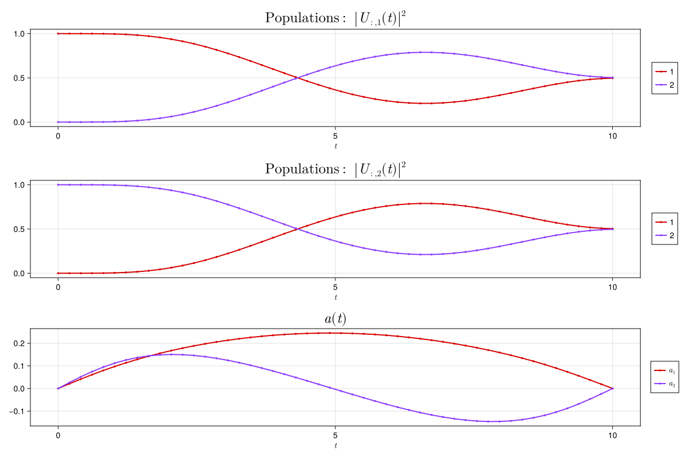

```@meta
CurrentModule = QuantumCollocation
```

# QuantumCollocation.jl

*Direct Collocation for Quantum Optimal Control* ([arXiv](https://arxiv.org/abs/2305.03261))

Check out our JuliaCon 2023 talk:

```@raw html
<center>
<iframe width="560" height="315" src="https://www.youtube.com/embed/NBdck6UX0Tc?si=YE4iK0mO4GlWnbaW" title="YouTube video player" frameborder="0" allow="accelerometer; autoplay; clipboard-write; encrypted-media; gyroscope; picture-in-picture; web-share" referrerpolicy="strict-origin-when-cross-origin" allowfullscreen></iframe>
</center>
```

Also check out [the sequel, from JuliaCon 2024](https://www.youtube.com/watch?v=v0RPD4eSzVE&t=19980s).

## Example

```Julia
using QuantumCollocation

T = 50
Δt = 0.2
system = QuantumSystem([PAULIS[:X], PAULIS[:Y]])

# Hadamard Gate
prob = UnitarySmoothPulseProblem(system, GATES[:H], T, Δt)
solve!(prob, max_iter=100)

plot_unitary_populations(prob)
```


## Motivation

In quantum optimal control, we are interested in finding a pulse sequence $a_{1:T-1}$ to drive a quantum system and realize a target gate $U_{\text{goal}}$. We formulate this problem as a nonlinear program (NLP) of the form

```math
\begin{aligned}
\underset{U_{1:T}, a_{1:T-1}, \Delta t_{1:T-1}}{\text{minimize}} & \quad \ell(U_T, U_{\text{goal}})\\
\text{ subject to } & \quad f(U_{t+1}, U_t, a_t, \Delta t_t) = 0 \\
\end{aligned}
```

where $f$ defines the dynamics, implicitly, as constraints on the states and controls, $U_{1:T}$ and $a_{1:T-1}$, which are both free variables in the solver. This optimization framework is called *direct collocation*.  For technical details of our implementation please see our paper [Direct Collocation for Quantum Optimal Control](https://arxiv.org/abs/2305.03261).

The gist of the method is that the dynamics are given by the solution to the Schrodinger equation, which results in unitary evolution given by $\exp(-i \Delta t H(a_t))$, where $H(a_t)$ is the Hamiltonian of the system and $\Delta t$ is the timestep.  We can approximate this evolution using Pade approximants:

```math
\begin{aligned}
f(U_{t+1}, U_t, a_t, \Delta t_t) &= U_{t+1} - \exp(-i \Delta t_t H(a_t)) U_t \\
&\approx U_{t+1} - B^{-1}(a_t, \Delta t_t) F(a_t, \Delta t_t) U_t \\
&= B(a_t, \Delta t_t) U_{t+1} - F(a_t, \Delta t_t) U_t \\
\end{aligned}
```

where $B(a_t)$ and $F(a_t)$ are the *backward* and *forward* Pade operators and are just polynomials in $H(a_t)$. 

This implementation is possible because direct collocation allows for the dynamics to be implicit. Since numerically calculating matrix exponentials inherently requires an approximation -- the Padé approximant is commonly used -- utilizing this formulation significantly improves performance, as, at least here, no matrix inversion is required.


## Index

```@index
```

